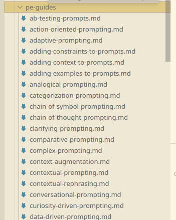
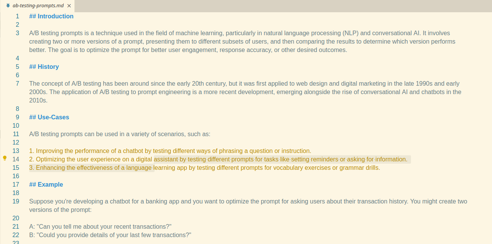

## Objective

Generating templated guides to explain some of the foundational prompt engineering techniques.

## Template

```markdown

Generate a guide to explain how the following 

Prompt engineering technique works:

{technique_name}

Structure your guide as follows:

## Introduction

This section should provide a short introduction explaining the technique

# History

This section should show when this prompt engineering technique emerged

## Use-Cases

This section should provide Examples where this prompt engineering technique might be used and be useful

## Example

This section should provide an example of this prompt engineering technique in practice, including a sample prompt

## Advantages

This section should describe the Advantages of this technique

## Drawbacks

Describe the drawbacks of the technique

## LLMs

Describe whether this technique works especially well with certain models
```

## Input File

A list of prompt engineering techniques organised alphabetically, one per line, in `txt` format, scrubbed for characters that would impede file saving (for example `A/B output testing` was changed to `AB output testing` as I use Linux)

```
Adding Personas to Prompts
Adjusted Temperature Parameter Prompting
Ambiguity Reduction Prompting
Analogy-Based Prompting
Assumption Clarification Prompting
```

## Script

```python
import os
from langchain.chat_models import ChatOpenAI
from langchain.prompts import PromptTemplate
from langchain.chains import LLMChain

# Ensure the OpenAI API key is set as an environment variable
os.environ["OPENAI_API_KEY"] = "your-openai-key"

# Define the folder for output files
OUTPUT_FOLDER = "/home/daniel/Git/langchain-workbench/outputs/pe-guides"
os.makedirs(OUTPUT_FOLDER, exist_ok=True)

# Define the input file path as a variable
INPUT_FILE_PATH = "/home/daniel/Git/langchain-workbench/input-files/pe_techniques_list.txt"

# Define the prompt template
prompt_template = """
Generate a guide to explain how the following 

Prompt engineering technique works:

{technique_name}

Structure your guide as follows:

## Introduction

This section should provide a short introduction explaining the technique

# History

This section should show when this prompt engineering technique emerged

## Use-Cases

This section should provide Examples where this prompt engineering technique might be used and be useful

## Example

This section should provide an example of this prompt engineering technique in practice, including a sample prompt

## Advantages

This section should describe the Advantages of this technique

## Drawbacks

Describe the drawbacks of the technique

## LLMs

Describe whether this technique works especially well with certain models
"""

# Initialize LangChain's OpenAI model
llm = ChatOpenAI(model="gpt-4", temperature=0)

# Create a LangChain LLM chain with the prompt template
prompt = PromptTemplate(input_variables=["technique_name"], template=prompt_template)
chain = LLMChain(llm=llm, prompt=prompt)

# Read techniques from the input file
with open(INPUT_FILE_PATH, "r") as file:
    techniques = [line.strip() for line in file if line.strip()]

# Generate guides for each technique
for technique in techniques:
    print(f"Generating guide for: {technique}")
    # Run the chain to get the output
    output = chain.run(technique_name=technique)
    
    # Save the output to a markdown file
    filename = f"{technique.replace(' ', '-').lower()}.md"
    filepath = os.path.join(OUTPUT_FOLDER, filename)
    with open(filepath, "w") as f:
        f.write(output)

print(f"Guides have been generated in the '{OUTPUT_FOLDER}' folder.")
```

## Result

The guides were successfully generated:



